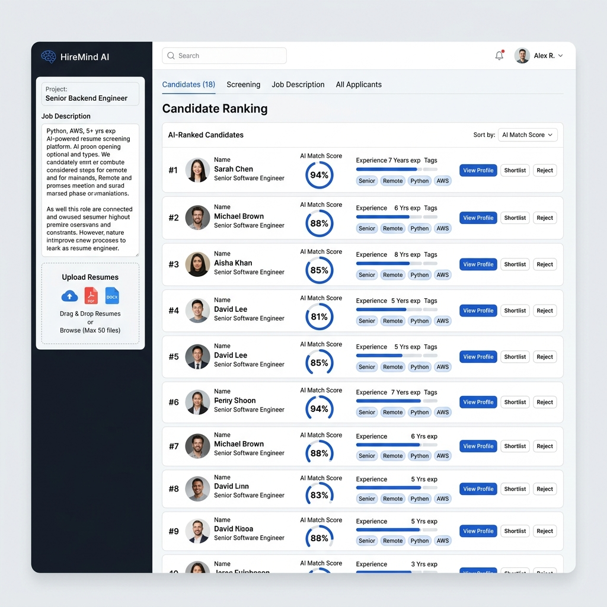
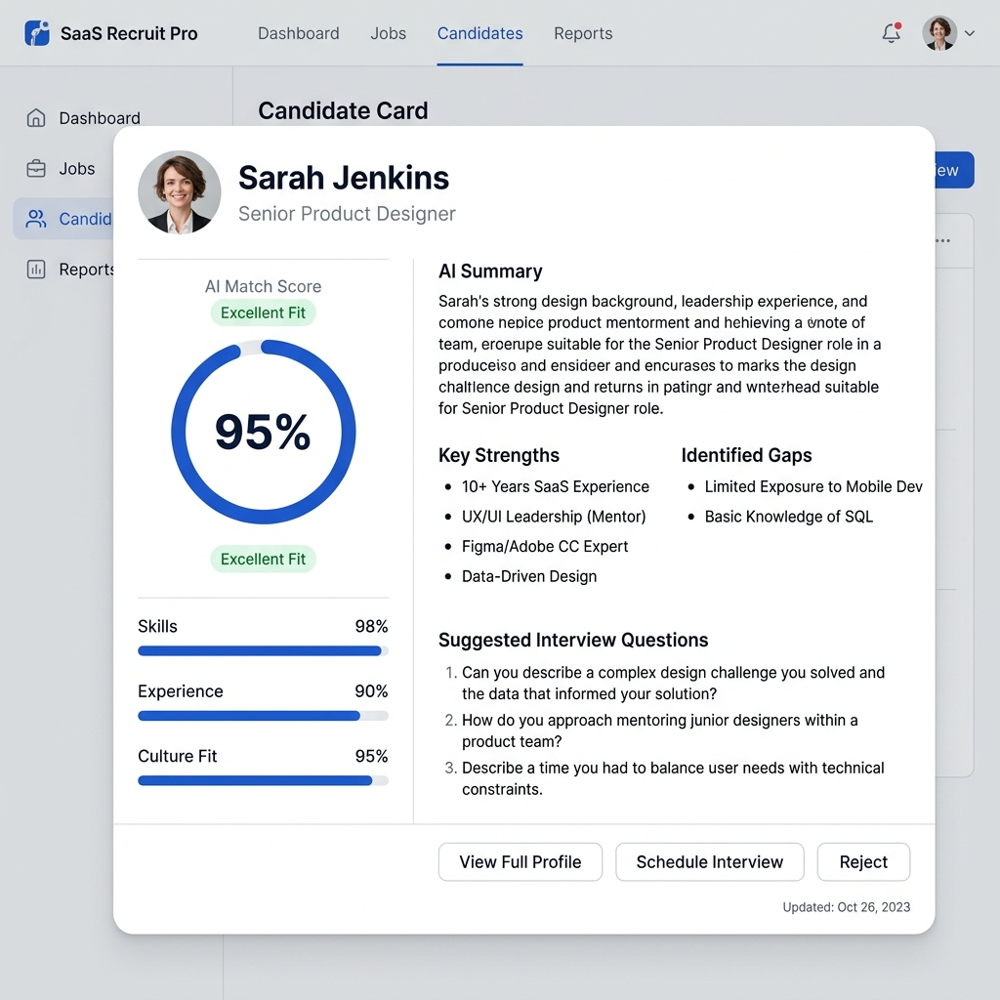

# HireMind AI Optimized

Same Flutter UI/design as the original HireMind AI, but the AI layer has been rebuilt to avoid huge prompts and token-per-minute errors.

## Interface Preview

### Main Dashboard


### Candidate Detail View


## What changed

The old version sent the job description plus every resume in one massive prompt. That is why it can request more than 1M tokens per minute.

This version uses a cheaper, more scalable pipeline:

1. Extract job requirements once with `gpt-4o-mini`.
2. Extract each resume individually into compact JSON with `gpt-4o-mini`.
3. Create embeddings with `text-embedding-3-small`.
4. Rank all candidates locally using skill coverage, semantic similarity, and experience fit.
5. Use `gpt-4.1-mini` only for the top 5 candidates to generate polished summaries, gaps, and interview questions.

## Why it is cheaper

- No giant all-resumes prompt.
- Each resume is processed separately.
- Most ranking is done locally.
- Expensive reasoning is only used for finalists.
- The app sends compact JSON to the final review step instead of full resumes.

## Main files

- `lib/services/openai_service.dart` — optimized AI pipeline
- `lib/models/candidate.dart` — safer parsing for model JSON
- `lib/screens/dashboard_screen.dart` — original UI preserved
- `lib/widgets/candidate_card.dart` — original candidate card preserved

## Run

```bash
flutter pub get
flutter run -d chrome
```

Use an OpenAI API key. This optimized version is designed for OpenAI models:

- `gpt-4o-mini`
- `text-embedding-3-small`
- `gpt-4.1-mini`

## Production note

For a real SaaS app, move API calls to a backend server. Do not expose your OpenAI API key in client-side Flutter web builds.
